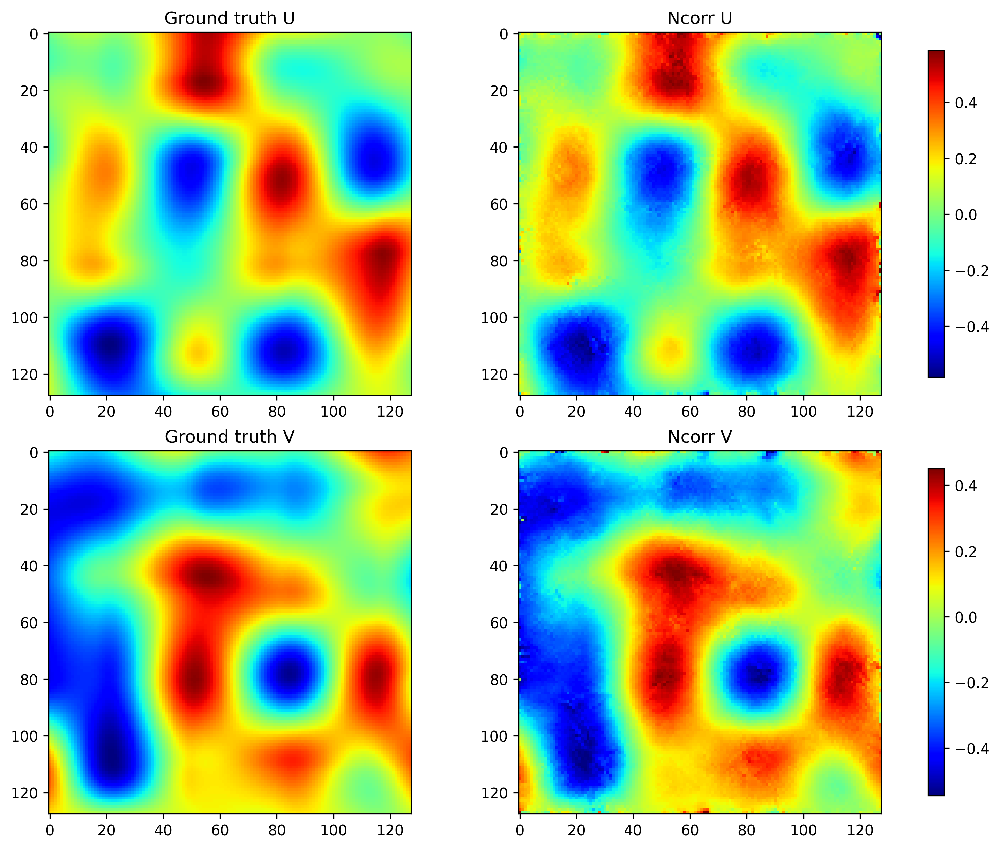
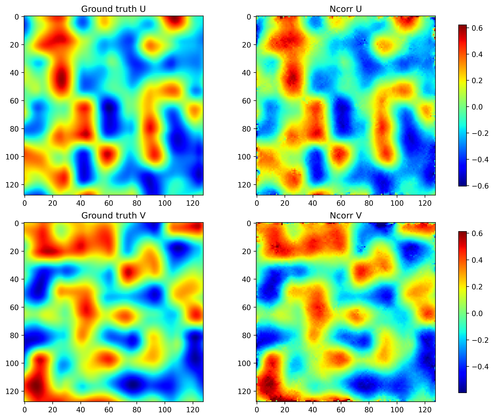
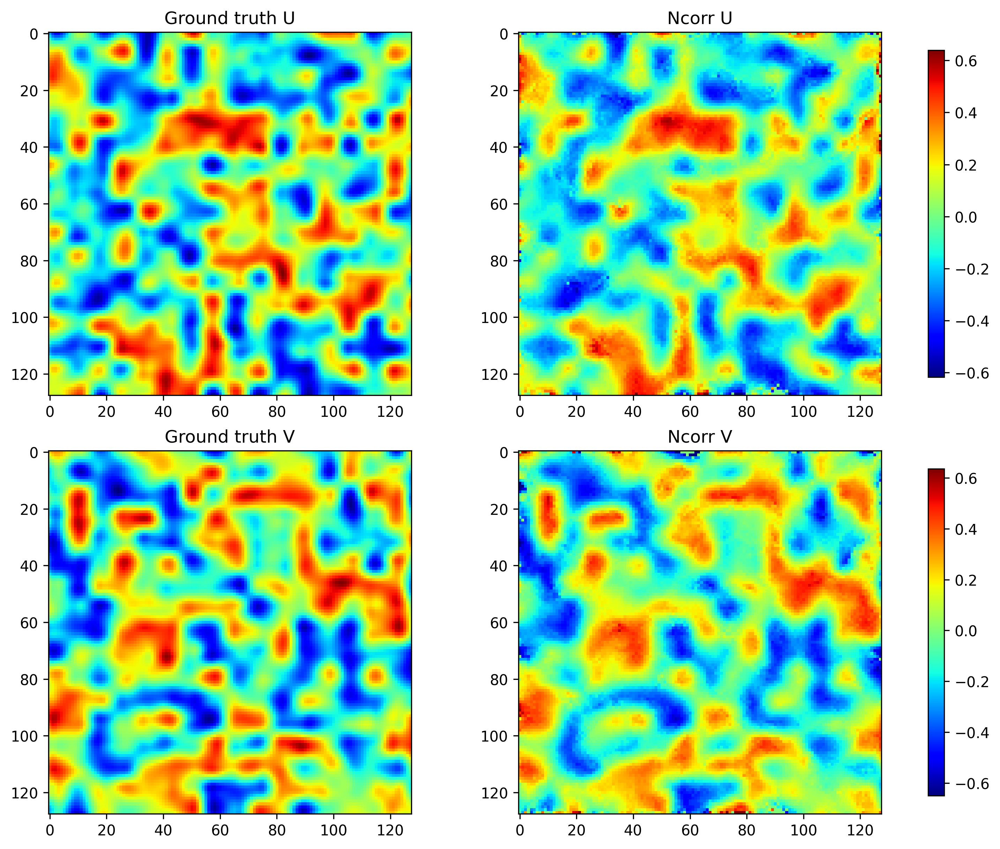
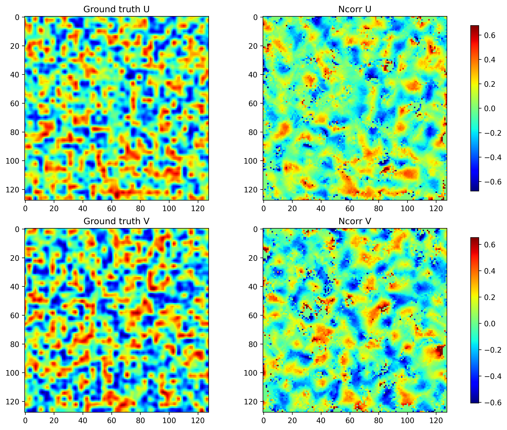
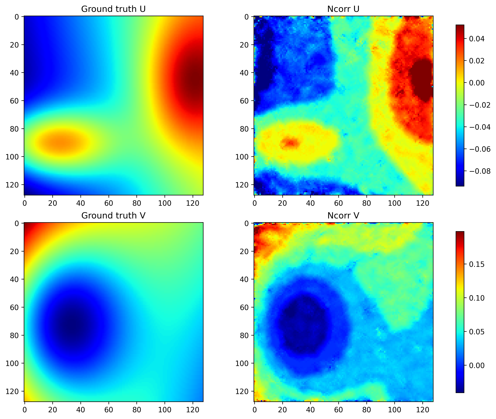
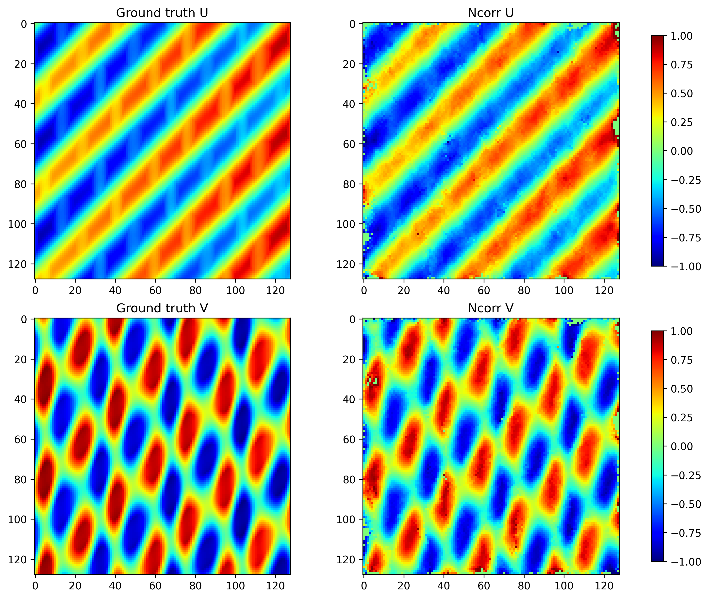
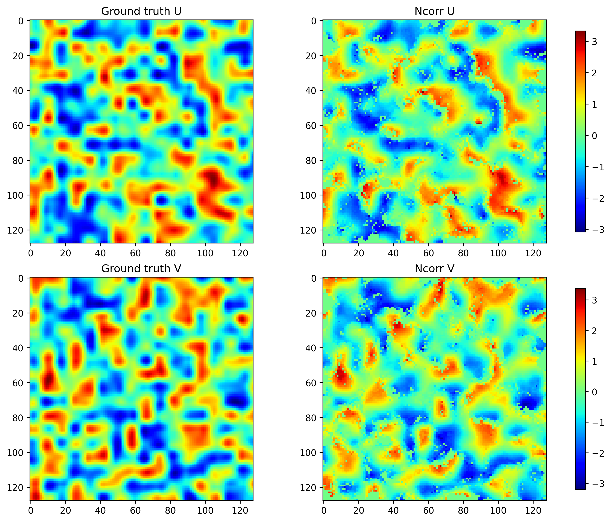
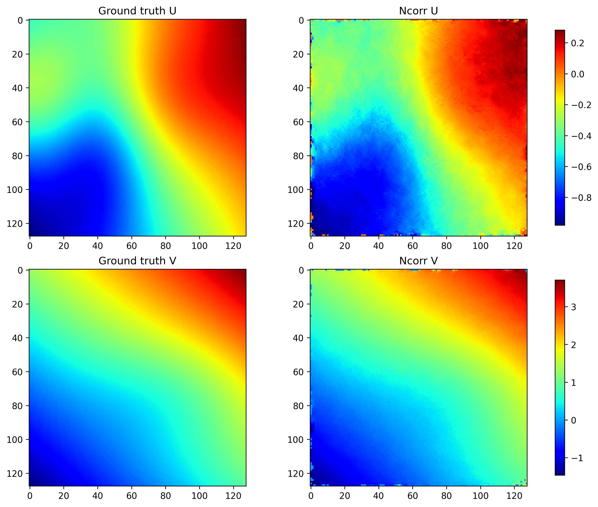
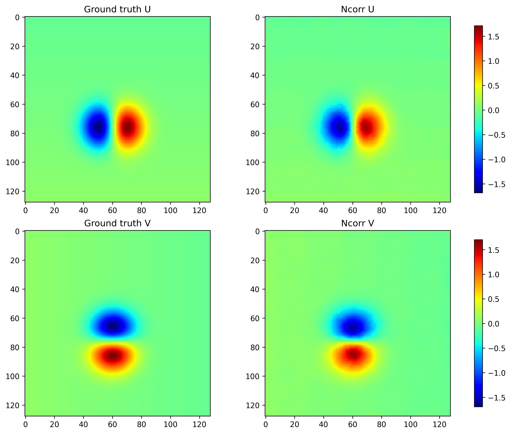
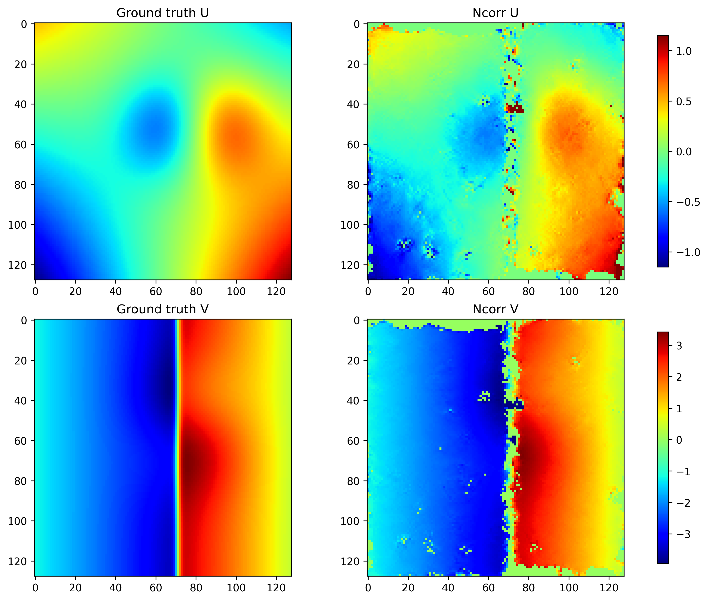

Use of NCORR to estimate the property. Fully automated script: DIC_NCORR.m.

Parameters that are important for 1 px 
radius = 4; # if increased less accurate 
spacing = 0; # the displacement is calculated at each pixel if spacing is 1 -> 64x64 pixels
cutoff_diffnorm = 0.0001; # if 0.001 less accurate
cutoff_iteration = 100; # if 50 less accurate

The obtained .mat files are transformed into npy files with mat_to_npy.py. Then RMSE is calculated over the all set of data with RMSE.py.

------
Results for 1 pixel
___

GridC1_1px

Number of images      : 8000

Applied displacement analysis:

Mean max displacement : 0.788701

Std                  : 0.051190

Median               : 0.801585

Min                  : 0.541597

Max                  : 0.918407

95th percentile      : 0.853811

Root Mean Square Error:

Mean RMSE  : 0.149212

Std  RMSE  : 0.195750

Median RMSE : 0.11735314501279066

90th percentile  : 0.25977348623532226

95th percentile  : 0.26863765055628047

Max RMSE : 8.779842657249894

Illustration on the performance of DIC vs. the cell size of the grid-node displacement methods from large to small.

Yang_1px

Number of images      : 8000

Mean max displacement : 0.737222

Std                  : 0.200531

Median               : 0.740110

Min                  : 0.163647

Max                  : 0.999999

95th percentile      : 0.999999

Mean RMSE  : 0.096060

Std  RMSE  : 0.087014

Median RMSE : 0.08814935228764523

90th percentile  : 0.15170013439588767

95th percentile  : 0.16989188148225273

Max RMSE : 6.476326799733408

PBD_5_1px

Number of images      : 8000

Mean max displacement : 0.774202

Std                  : 0.291669

Median               : 0.971231

Min                  : 0.001193

Max                  : 1.000000

95th percentile      : 1.000000

Mean RMSE  : 0.147008

Std  RMSE  : 0.320947

Median RMSE : 0.10991964715101836

90th percentile  : 0.20653508736059353

95th percentile  : 0.35249849345846856

Max RMSE : 14.109419979641409

_____________________
Results for 5 pixels
_____________________

GridC1_5px
_____________________

Number of images      : 8000

Mean max displacement : 3.952496

Std                  : 0.244941

Median               : 4.008743

Min                  : 2.887826

Max                  : 4.761935

95th percentile      : 4.267730

Mean RMSE  : 1.439403

Std  RMSE  : 1.327380

Median RMSE : 0.9258147627492652

90th percentile  : 2.871485117384527

95th percentile  : 3.913112819624889

Max RMSE : 21.600187630561713

Yang_5px
Number of images      : 8000

Mean max displacement : 3.686933

Std                  : 1.011447

Median               : 3.716149

Min                  : 0.747303

Max                  : 4.999999

95th percentile      : 4.999999

Mean RMSE  : 0.611423

Std  RMSE  : 0.474932

Median RMSE : 0.5238328806228842

90th percentile  : 1.0425112376574897

95th percentile  : 1.194558247977919

Max RMSE : 12.015759413433614

PBD_5_5px
Number of images      : 8000

Max displacement
Mean max displacement : 3.801873

Std                  : 1.463627

Median               : 4.535268

Min                  : 0.007143

Max                  : 5.000000

95th percentile      : 5.000000

Mean RMSE  : 1.197089

Std  RMSE  : 1.229919

Median RMSE : 0.8403916166014225

90th percentile  : 3.0981642147859816

95th percentile  : 3.957130044449129

Max RMSE : 11.48182482686985

