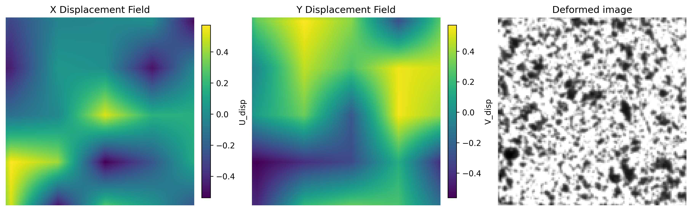
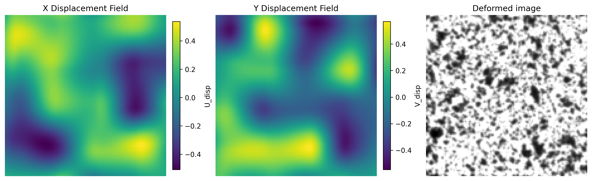
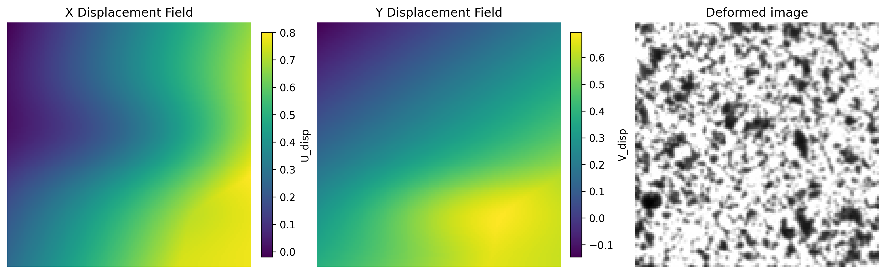
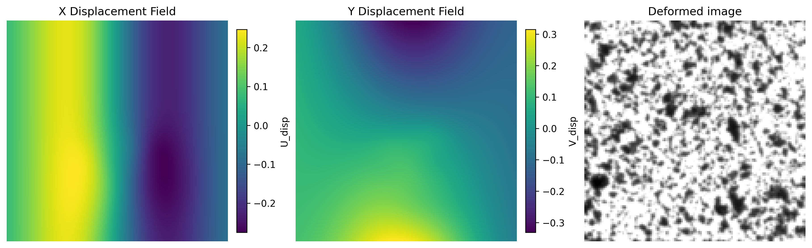
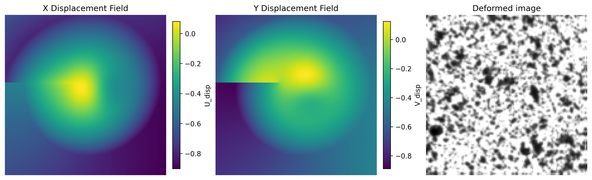

A deformed image is obtained from a reference image by applying the following transformation, 
$M(x)$ 
$$\forall X, x=X+u(X), I_{def}(X)=I_{ref}(X+u(X))$$
There are two main types of methods:
-Grid node based method: Grid-based methods divide the image into a regular grid whose node displacements are assigned randomly. A continuous displacement field is then obtained by interpolating between the grid nodes. By adjusting the grid spacing and the magnitude of the prescribed nodal displacements, the spatial frequency and amplitude of the displacement field can be readily controlled.

-Mathematical function based methods. These methods define deformation fields using a variety of mathematical functions, including basic transformations (translation, rotation, stretching, shearing, scaling, and affine transformations) as well as nonlinear deformations (e.g., sinusoidal deformations, displacement jump...).

1. Grid node based models
-  DataSet from (Boukhtache et al., 2021): The first step consisted of splitting each reference image into adjacent square regions of size 8×88 \times 88×8 pixels. The pixels located at the corners of these regions were assigned random displacements. In the second step, the displacement field within each square region was obtained by linear interpolation of the corner displacements. Since the objective was to estimate subpixel displacements, the random displacements were uniformly distributed between −1-1−1 and +1+1+1 pixel. Furthermore, the displacements at the image boundaries were set to zero to reduce errors associated with the lack of information in these regions. This procedure produces a continuous displacement field; however, because the interpolation is piecewise linear, the displacement gradients—and therefore the strain field—are generally discontinuous across the boundaries between adjacent regions.       
 To avoid padding of the cell size (Wang,2026) used larger images 480x480 image for DICnet, apply a grid a grid based displacement as (Boukhtache et al., 2021) with two parameters, grid spacing and maximum node displacement and crop 256x256 pixels region from the central aera of hte original images.
 
  We propose to padd the original image by periodicity to avoid a border of zero displacement of the cell size length like that larger images are not necessary. Plus, for each deformed image the first node of the grid is randomly chosen at $(x,y)$ with x and y $\in [0,cellsize-1]$. Finally the cell size varies to provide with a dataset containing several frequencies as proposed by other authors (see below).
  

Figure: Example of U and V displacements for a modified Boukhtache et al. (2021) grid method for a cell size of 32 on a reference image of 128x128 pixels. Deformed image is also 128x128 pixels.

- Use of Hermite elements to generate displacement fields whose strain field is continuous based on [[2023_Wang.pdf]] (https://doi.org/10.1016/j.optlaseng.2022.107278)
	This provides with a $C^1$ displacement field.
	They introduced different cell dimensions (5,9,17,33,65) for each generated sample, which creates a multi-frequency training set and is probably one of the reasons their network generalizes well over a large range of strain levels.
    The difference with pre-cited paper is that 1) we directly deform the reference images (while they proposed to create reference images from deformed images with inverse Hermite elements) 2) we add padding by image periodicity 3) the start of the grid varies instead of always being at (0,0) 4) We use a scaling law $u_x = \frac{\partial u}{\partial x}=u_{max}/h$  and $u_{xy} = u_{max}/h^2$ with $h$ the dimension of the elements and $u_{max}$ is the maximum displacement otherwise the fields become extremely oscillatory. 

 Figure : Exemple of displacement fields and deformed image obtained with Hermite grid-based displacement method (cell 32, image 128x128)

- Dataset [[2025_Cheng.pdf]] (https://doi.org/10.1016/j.optlastec.2024.111414) and [[2025_Dan.pdf]](https://doi.org/10.1364/OE.553602)
	Applied deformation random to nodes and Spline interpolation -> Very smooth, displacement is $C^2$
	Different 'scales' (grid-spacing at which the displacement is randomly chosen) like the previous method to have several frequency of displacement
	Bicubic interpolation 
	Border of two pixels has zero displacement to avoid extrapolation problems during image warping
	Add of a random grayscale noise with a mean of 0 and a standard deviation of 4 
	
	Cheng uses cubic `RectBivariateSpline` rather than bilinear `RegularGridInterpolator`. It was adpated as Boukhtache and Hermite with periodic padding to avoid the undeformed edges and with random position of the grid to avoid grid lines
  ![[Example_Cheng_2_32.png]]
  ![[Example_Cheng_2_16.png]]![[Example_Cheng_2_8.png]]
  ![[Example_Cheng_2_4.png]]
  Figure : Exemple of displacement fields and deformed image obtained with Cheng grid-based displacement method (cells 32, 16, 8, 4 for image 128x128)

2. Mathematical function based displacement
- Dataset from R. Yang, Y. Li, D. Zeng, P. Guo, Deep dic: Deep learning-based digital 
image correlation for end-to-end displacement and strain measurement, Journal of Materials Processing Technology 302 (2022) 117474. doi: https://doi.org/10.1016/j.jmatprotec.2021.117474.
	A two-dimensional displacement field is generated for each sample image by combining random rigid-body translation, rotation, stretch/compression, shear, and localized deformations described by two-dimensional Gaussian functions.
	![[Equations_Yang2022.pdf]]
 .       Definition of the displacement strain field.
	The first part is affine and is homogeneous in the image for stretch, shear, translation and rotation. The second part (Gaussian displacement) adds some strain gradients, localization and multiscale deformations. The displacement is maximum at $(x_0,y_0)$ and decay on the sides. As $\epsilon_{xx} = \frac{\partial u_g}{\partial x} = - A \frac{x-x_0}{\sigma_x^2} u_g$, one side is in compression and the other in tension. Note that if only $u_g$ is activated: shear band, If $u_g$ ad $v_g$ are centered differently: crack opening displacement, If $\sigma_x>>\sigma_y$: necking
	
	Note: The type of applied strain is rather smoth and all types of deformation are applied on all deformed images
	

Figure : Illustration of Yang's applied displacement on 128x128 pixels image
	

- Original Physics Based Displacement (PBD) Dataset 

	Displacement inspired by what is encountered in mechanics of materials are defined like rigid body, stretching,  high frequency but muche more 
	Among several types of displacements a random combination of up to $n_{max}$ are applied.
	
   
 Physical modes:
	 -Stretching, simple shear, radial displacement, rigid body translation and rotation, localized strain , shear bands, high frequency perturbation, shock wave, warping
    -isotropic_dilation` – uniform (thermal-like) expansion, same coefficient in X and Y
	-`poisson_biaxial` – elastic biaxial stretch with εy = -ν·εx coupling
	-`barreling` – compression counterpart to necking (axis-swapped version of the same band logic)
	-`void_coalescence` – 2–4 cavities clustered near each other so their fields interact/merge
	-`crack_tip_KI` / `crack_tip_KII` – real Williams LEFM near-tip fields (√r singularity + angular dependence), replacing the tanh approximation for anyone who needs physically accurate fracture data. I kept your original `crack_open`/`crack_slide` too, since the smoothed step is still a cheap, useful discontinuity-like mode — the docstring now clarifies when to prefer which.
	-`contact_indentation` – Hertzian-inspired localized push + lateral pile-up
	-`delamination_blister` – ring-shaped profile (peaks at the delamination front, not the center), distinct from `inclusion`/`cavity`
	-`buckling` now sums 1–2 harmonics instead of a single sine, for more realistic wrinkle patterns
	-Added an optional `max_total_disp` cap that rescales the combined field per-pixel so stacking up to 5 modes can't produce runaway displacements
	-Added `nu` (Poisson's ratio) and `plane_stress` parameters, threaded through to `process_images`, since the crack-tip and biaxial modes need them
	-Comments throughout explaining the physical meaning of each mode and, where two modes look similar (`radial_disp` vs `cavity`, `inclusion` vs`delamination_blister`), a note on how they actually differ Wrapped the script's execution in `if __name__ == "__main__":` so the module can be imported without auto-running
 
 One thing worth deciding: the crack-tip `K_I`/`K_II` amplitudes are _synthetic_ units scaled by `max_disp`, not real stress-intensity factors in MPa·√m 

 Figure: Illustration of random displacement obtained with coupled PBD displacement ( $n=5$ on 128x128 pixels image)

To generate the datasets we build a 200 references images set from one large actual speckle images in which the 128x128 images were cropped randomly in order to obtain a variety of light and density. Each reference image is deformed 200 times with the chosen dataset generation method (GridC0, GridC1, GridC2, Yang, PBD). The parameters used to generate our datasets are given in [[Generated Datasets]].

Other dataset not tested here
- DataSet from G. Wang, Y. Zhou, Z. Wang, J. Zhou, S. Xuan, X. Yao, Strainnet-ld: Large displacement digital image correlation based on deep learning and displacement-field decomposition, Optics and Lasers in Engineering 183 (2024) 108502. doi:https://doi.org/10.1016/j.optlaseng.2024.

   Files for generating synthetic images, apply deformation and interpolation are available here        https://github.com/GW-Wang-thu/2D-DIC-Dataset-Generation-using-Interpolation
	
  Applied displacements include:
	  **Continuum deformation** (`u_1,v_1`) 
	    smooth heterogeneous random field
	    spatially varying strain with randint(50,200) low frequency 200 high frequency 50 - (Similar as [[2021_Boukhtache_et_al.pdf]] for linear interpolation and similar as [[2024_Cheng.pdf]] for cubic interpolation)
	  Affine deformation (`u_4,v_4`) (This is the same as in [[2021_Yang.pdf]])
	    translation
	    rotation
	    stretch
	    shear
	 Crack deformation (different from LEFM)
	 A crack tip is defined at $(x_c,y_c)$ the crack occupies a region defined by $\theta_0<\theta<\theta_1$ with $\theta_0 \in [0,5.5]$ and $\theta_1-\theta_0 \in [0.6,1.0]$  so the crack covers approximately 35 to 60°. $\theta=atan2(x-x_c,y-y_c)$. They defined a wavy front of the crack instead of a circular one: $R=R_0+a_1 \sin(n_1\theta)+a_2 \cos(n_2\theta)+a_3(\theta-\theta_0)(\theta-\theta_1)$
	 The displacement acts only for $\rho\in [0.5R,2R]$ in the angular sector $\theta \in [\theta_0,\theta_1]$ with $\rho=\sqrt{(x-x_c)^2+(y-y_c)^2}$.
	 The displacement amplitude is $A(\rho,\theta)=A_0(\theta-\theta_0)(\theta-\theta_1)\sqrt{|\rho-0.5R|}\sqrt{|2R-\rho|}\frac{10}{R}$
	 Therefore the displacement goes smoothly to zero at $0.5R$, $2R$, $\theta_0$ and $\theta_1$.
	 A sign reversal parameter $s$ is defined for the displacement changes sign when crossing the curve $\rho=R(\theta)$.
	 Displacement direction is radial: $u=A(\rho,\theta) s cos(\theta)$ and $v=A(\rho,\theta) s sin(\theta)$
	 Finally a Gaussian Blur has been added as u = cv2.GaussianBlur(u0,(0,0),sigmaX=2) so the discontinuity is smoother to add numerical stability.
	 Crack closing deformation (`u_3,v_3`)
	    localized radial inward displacement
	 Crack opening deformation (`u_2,v_2`)
	    localized displacement discontinuity
	    creation of missing pixels through `def_mask`
	    
	Specific  interpolation file is provided which is not using openCV classic function. However, option bicubic is the generic bicubic interpolation.
	
- DataSet based on finite elements simulations. 
  I read several times that it could be an option. However there are major drawbacks to this approach. 1. Building such a dataset would demand to consider a large number of microstructures, mechanical behavior and loading cases. 2. The dataset would depend on the microstructures (presence of different materials, pores...) and on the constitutive behaviors chosen to run the simulations. 
  So this method was discarded as it demands extensive work while creating a dataset biased by what is already know about materials. 

Further comments
	Many datasets use a random crop step after the imaged have been deformed. So for instance images of 256x256 are deformed and then a region of 128x128 is randomly croped. It is the same region in the reference and deformed image that is chosen. We saw that for grid based methods, necessary precautions were needed to avoid a zero-displacement padding around the images. We have proposed to pad the existing image with a periodicity assumption. This has the advantage of not requiring larger images. 
	

**Parameters**

For Reference images folder containing 200 images of 128x128 pixels

- Subpixel datasets
	[GridC0_1px](Codes/Dataset_codes/GridC0_Boukhtache2021.py)
	cell_size2 = [4,8,16,32] 
	TARGET_MAX_DISP = 1.0

	[GridC1_1px](Codes/Dataset_codes/GridC1_Hermite.py)
	element_size = [4,8,16,32]
	TARGET_MAX_DISP = 1.0
	max_disp = 0.58 * TARGET_MAX_DISP   
	max_grad_factor = 1.0     
	max_cross_factor = 1.0 

	[GridC2_1px](Codes/Dataset_codes/GridC2_Cheng2025.py)
	noise_std = 0
	max_disp = 1
	scales = [ 32, 16, 8, 4] # Randomly chosen

	[Yang_1px](Codes/Dataset_codes/Yang_2022.py) and [PBD_X_1px](Codes/Dataset_codes/PBD_2026.py): [config_1px.json](Codes/Dataset_codes/config_1px.json)
	

- 5 pixels datasets
	[Yang5px](Codes/Dataset_codes/Yang_2022.py) and [PBD_X_5px](Codes/Dataset_codes/PBD_2026.py): [config_1px.json](Codes/Dataset_codes/config_5px.json)
	
	[GridC0_5px](Codes/Dataset_codes/GridC0_Boukhtache2021.py)
	cell_size2 = [4,8,16,32] 
	TARGET_MAX_DISP = 5.0
	
	[GridC1_5px](Codes/Dataset_codes/GridC1_Hermite.py)
	element_size = [4,8,16,32]
	TARGET_MAX_DISP = 5.0
	
	[GridC2_5px](Codes/Dataset_codes/GridC2_Cheng2025.py)
	noise_std = 0
	max_disp = 5
	scales = [ 32, 16, 8, 4] # Randomly chosen
